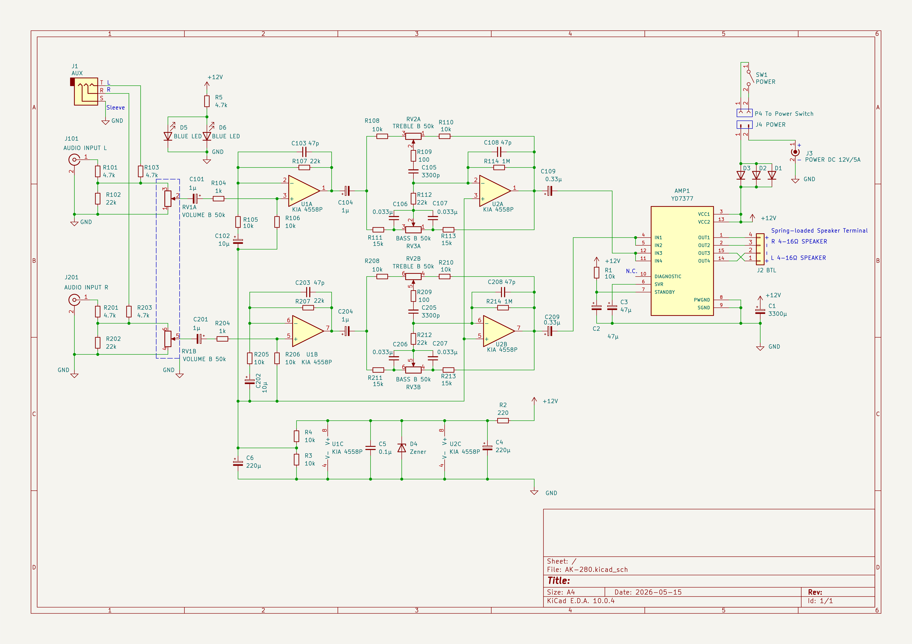
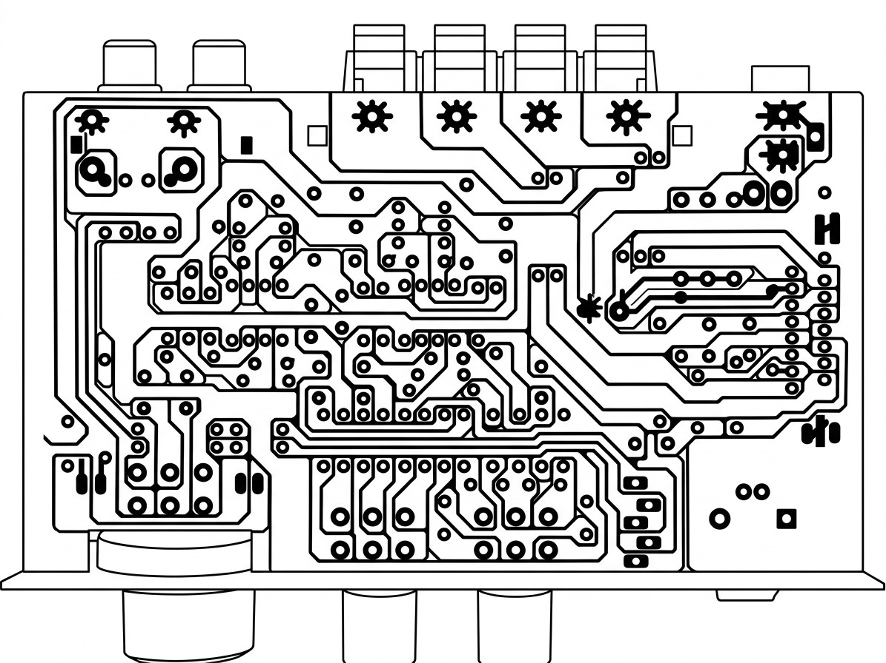

# ak280-schematics

[English README is here](README.md)

このリポジトリには、Amazonで購入したAK-280オーディオアンプの回路図が含まれています。回路図は、プリント基板のパターンと部品をトレースして作成しました。KiCadを使用して作成されています。

   
  図 1: AK-280 回路図

<table style="width: 100%; border: none;">
  <tr>
    <td style="width: 50%; text-align: center; border: none;">
       
      図 2: AK-280 クローズアップ
    </td>
    <td style="width: 50%; text-align: center; border: none;">
       
      図 3: AK-280 SPシステム
    </td>
  </tr>
  <tr>
    <td style="width: 50%; text-align: center; border: none;">
       
      図 4: PCB部品面(参照番号付き)
    </td>
    <td style="width: 50%; text-align: center; border: none;">
       
      図 5: PCBハンダ面(参照番号付き)
    </td>
  </tr>
  <tr>
    <td style="width: 50%; text-align: center; border: none;">
       
      図 6: PCBハンダ面(参照番号付き、ミラー反転)
    </td>
    <td style="width: 50%; text-align: center; border: none;">
       
      図 7: AI生成リファレンス
    </td>
  </tr>
</table>

## プロジェクトの目的
このプロジェクトは個人的な趣味の目的でのみ作成されました。特定の意図や目標はありません。

## ディレクトリ構造

    ak280-schematics/
    ├── hardware/
    │   ├── AK-280.kicad_pro
    │   └── AK-280.kicad_sch
    ├── images/
    │   ├── ak280-schematic.pdf
    │   ├── ak280-photo.png
    │   ├── ak280-system-photo.png
    │   ├── fig01-topside-with-refno.png
    │   ├── fig01-topside-with-refno.zip
    │   ├── fig02-bottomside-with-refno-org.png
    │   ├── fig02-bottomside-with-refno-org.zip
    │   ├── fig03-bottomside-with-refno-mirror.png
    │   ├── fig03-bottomside-with-refno-mirror.zip
    │   └── fig04-ai-generated-reference.png
    ├── LICENSE
    ├── README.ja.md
    └── README.md

## ファイルの説明

* **hardware/**: KiCadの全回路図ファイルおよび設計データ。
* **images/**: 以下の回路図および関連資料:
    * **ak280-schematic.pdf**: 回路図 (PDFファイル)
    * **ak280-photo.png**: AK-280のクローズアップ写真
    * **ak280-system-photo.png**: AK-280 SPシステム写真
    * **fig01-topside-with-refno.png**: 回路参照番号付き部品面写真 (閲覧用)
    * **fig01-topside-with-refno.zip**: 回路参照番号付き部品面写真 (GIMPソースデータ)
    * **fig02-bottomside-with-refno-org.png**: 回路参照番号付きハンダ面写真 (オリジナル、閲覧用)
    * **fig02-bottomside-with-refno-org.zip**: 回路参照番号付きハンダ面写真 (オリジナル、GIMPソースデータ)
    * **fig03-bottomside-with-refno-mirror.png**: 回路参照番号付きハンダ面写真 (ミラー反転、閲覧用)
    * **fig03-bottomside-with-refno-mirror.zip**: 回路参照番号付きハンダ面写真 (ミラー反転、GIMPソースデータ)
    * **fig04-ai-generated-reference.png**: AIによって生成され、目視確認されたパターン図。
* **LICENSE**: プロジェクトのライセンス情報。
* **README.ja.md**: 日本語の詳細なプロジェクト説明(本ファイル)。
* **README.md**: 英語の詳細なプロジェクト説明。

## 環境
* **KiCad**: 10.0.4
* **GIMP**: 3.2.4

## 使い方

* **回路図を見る**: `images/ak280-schematic.pdf` を参照してください。
* **部品番号を見る**: `images/fig01-topside-with-refno.png` および `images/fig02-bottomside-with-refno-org.png` を参照してください。
* **回路図を編集する**: KiCadを起動し、`hardware/AK-280.kicad_pro` を開いてください。
* **部品番号を編集する**: `images/fig01-topside-with-refno.zip`、`images/fig02-bottomside-with-refno-org.zip`、または `images/fig03-bottomside-with-refno-mirror.zip` を展開し、GIMPで開いてください。

## 免責事項
このリポジトリの回路図は、実際の基板の目視検査と、AI生成されたパターン図(`fig04-ai-generated-reference.png`)に基づいて作成されています。正確性を確保するためにあらゆる努力が払われていますが、ネットリストの完全性は100%保証されていません。著者は、このデータを使用したことによって生じた損害、事故、予期せぬ誤動作、その他の損失について、一切の責任を負いません。自己責任で使用してください。

## 謝辞
* このプロジェクトで使用されているTDA7377 KiCadシンボルは、Snapmagic (https://www.snapmagic.com/) によって提供されています。

## ライセンス
このプロジェクトはMITライセンスの下でライセンスされています。詳細は [LICENSE](LICENSE) ファイルを参照してください。